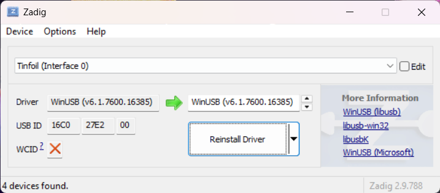

`frhop {-s|-t} {list of directories or nsps}`  
> Note; first time users must setup the [USB driver](#usb-driver). 
---
Tiny utility to serve Switch archives over USB interface - a lightweight (~500kb!) alternative to [`nut`](https://github.com/blawar/nut).  

[Tinfoil](https://tinfoil.io) and [Sphaira](https://github.com/ITotalJustice/sphaira) supported. By default, `frhop` launches in `Tinfoil` mode, specify `-s` flag to host for `Sphaira`.  

# `frhop` vs `nut`
- Speed-wise it's slightly faster than `nut` (~10% faster)  
- Pure rust + completely static - no fiddling with `pip` on non-Windows platforms
- Only `nut`'s USB functionality implemented 
- `nut` requires filenames to contain TitleID, `frhop` can extract from `nsp`
- Couple of other QoL improvements that should fix hangs `USB` users may have experienced with `nut`
- All switch archive formats are supported (`nsp`, `xci`, `nsz` etc)

# Limitations 
Tinfoil's USB interface can be a bit finicky at times, here are the most common issues. Note, everything here affects `nut.py` as well.  
- USB connection may not be restored if you unplug and replug the Switch with Tinfoil opened - restart Tinfoil or put the Switch to sleep and wake again
- Tinfoil only gets package listing at the start, to update you must close/re-open the app - or get the file from `File browser > usb:/`
- Tinfoil is (tragically) one-threaded - concurrent downloads not possible
- Once you connect USB, Tinfoil will freeze for 1-2 seconds as it parses the package headers to extract info

# USB driver
Depending on your platform, driver setup may be required.  
## Mac
Works without any additional configuration 🥳 
## Windows
Windows users must install the `WinUSB` driver using [`Zadig`](https://zadig.akeo.ie)

**Note**; if you have used [`nut`](https://github.com/blawar/nut) before, `tinfoil_driver.exe` does not install the right driver needed here - follow these instructions to override with the correct driver 

1. Download [`Zadig`](https://zadig.akeo.ie)
2. Open `Tinfoil`, and plug in the switch
3. `Options > List all devices`
4. Select `Tinfoil (Interface 0)` from the dropdown
5. Select the WinUSB (v...) driver using the arrow keys, and press install   

## Linux
Will need to configure `udev` rules. Follow [`these`](https://docs.rs/nusb/latest/nusb/#linux) instructions. 
# Building
- No special steps, simply install [Rust](https://www.rust-lang.org) and build with Cargo
- To simpliy cross-compilation, I use [zig-build](https://github.com/rust-cross/cargo-zigbuild)